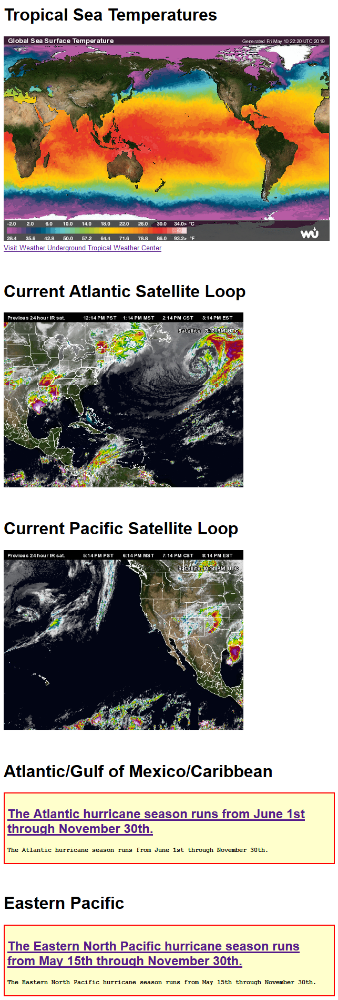

# NHC-tropical Hurricane RSS feeds

## Summary

This set of scripts will decode/display the RSS feeds from the National Hurricane Center for the Atlantic and Western Pacific basins.

A sample page (_tropical.php_) with WeatherUnderground maps and output of the RSS feeds shown.

Note: an updated sample image will be captured during the season to display the output normally available when a named storm is being tracked by the National Hurricane Center.

## Configuration

See comments in the script for additional customization options.  You likely will not need to customize the _rss-tropical-atlantic.php_ or the _rss-tropical-pacific.php_ scripts.  The _tropical.php_ script shows how they might be used in a page.

## Sample output - no alerts active

